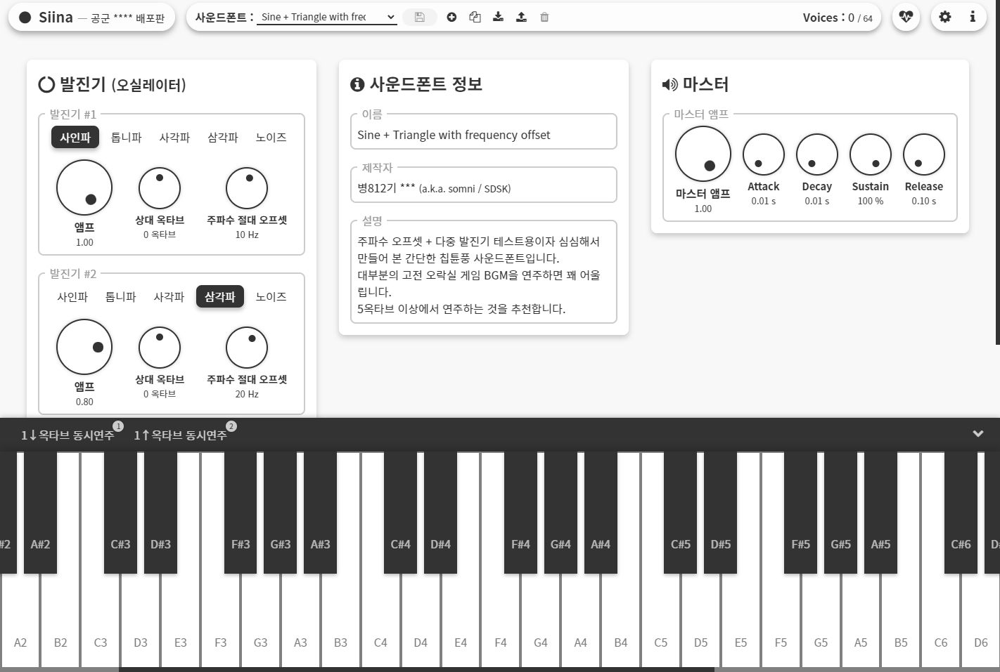

  

Siina
=====
 **Siina**는 **다중 오실레이터** 및 **마스터 볼륨(앰프) ADSR**이 지원되는 간단한 웹 기반 피아노 앱입니다.

 군 복무 기간 중에 심심풀이로 개발을 시작하여 약 1년 동안 업데이트를 했던 토이 프로젝트입니다.
 
 현재 [GitHub Pages로 v1.0.0 버전을 배포](https://somnisomni.github.io/siina/siina.html)하고 있습니다. 하지만 후술된 바와 같이 Siina는 로컬 환경에서만 작동될 것을 목적으로 개발되었기에, 일부 기능이 제대로 작동되지 않을 수 있습니다. [Siina v1.0.0을 사용해보려면 여기를 클릭하세요!](https://somnisomni.github.io/siina/siina.html)

버전 v1.0.0
-----------
 본 버전(**v1.0.0**, 브랜치 `old-v1.0.0`)는 전역 전 미복귀 휴가를 실시하기 전에 업데이트된 마지막 버전이고, 직전 버전(**v0.0.4-preview**, 브랜치 `old-v0.0.4`)에 비해 <ins>오실레이터 부분에 WebAudio API를 적극 이용한 것</ins>이 주된 변경 사항입니다.

 또한 이 버전부터 사운드폰트 데이터를 JSON 형태로 공유가 가능해졌습니다.

실행 방법
---------
 버전 v1.0.0까지의 Siina는 **로컬 환경** *(서버 없이 소스 코드를 내려받아 사용자의 웹 브라우저에서 직접 실행)* 에서만 작동될 것을 목적으로 개발되었습니다.

 [여기를 참고하거나](https://sosoeasy.tistory.com/318), [이 링크로 직접 다운로드하여](https://github.com/somnisomni/siina/archive/refs/heads/old-v1.0.0.zip) 해당 버전의 소스  다운로드 및 압축 해제한 후, `siina.html`을 웹 브라우저로 실행해주세요.

 이 외 자세한 사항은 [QuickStart.txt](QuickStart.txt) 파일을 참고해주세요.

트리비아
--------
 그간 개발한 Siina의 소스 코드를 인터넷에 올리기 위해 **도합 <ins>60페이지</ins> 가까이 프린트하여(...) 가져왔고**[*사진 첨부 예정*]**, 손수 옮길 예정**이였습니다...**만!** 익명의 사용자분께서 이 버전의 소스 코드를 전부 디지털로 보내주신 덕분에 고생을 덜 수 있었습니다. 감사합니다!

 소스 코드에서 일부 민감한 정보는 자체 마스킹하여 업로드하였습니다. 그 외에는 군 내에서 개발을 진행했던 내용물과 일치합니다.
