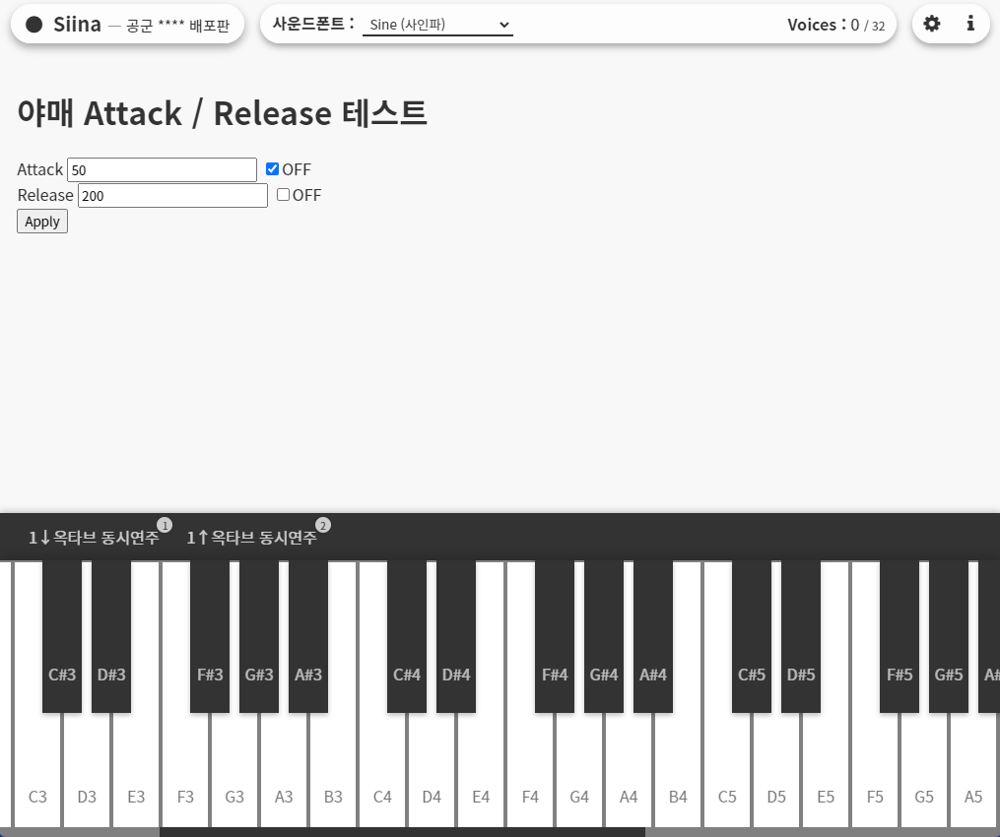
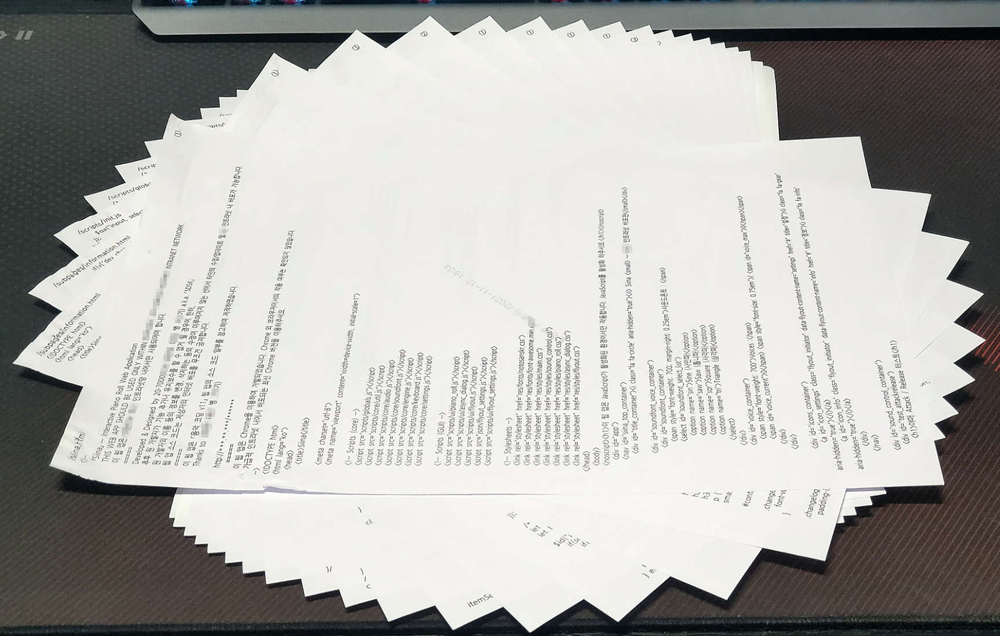

  

Siina
=====
 **Siina**는 ~~**다중 오실레이터** 및 **마스터 볼륨(앰프) ADSR**이 지원되는~~ 간단한 웹 기반 피아노 앱입니다. *(v0.0.4에서는 다중 오실레이터 및 ADSR 기능이 구현되지 않았습니다.)*

 군 복무 기간 중에 심심풀이로 개발을 시작하여 약 1년 동안 업데이트를 했던 토이 프로젝트입니다.
 
 현재 GitHub Pages로는 [v1.0.0 버전을 배포](https://somnisomni.github.io/siina/siina.html)하고 있습니다. 하지만 후술된 바와 같이 Siina는 **PC 상에서의 로컬 환경**에서만 작동될 것을 목적으로 개발되었기에, 일부 기능이 제대로 작동되지 않거나 오작동할 수 있습니다. [Siina v1.0.0을 사용해보려면 여기를 클릭하세요!](https://somnisomni.github.io/siina/siina.html)

버전 v0.0.4
-----------
 본 버전(**v0.0.4**, 브랜치 [`old-v0.0.4`](https://github.com/somnisomni/siina/tree/old-v0.0.4))는 [v1.0.0 버전](https://github.com/somnisomni/siina/tree/old-v1.0.0)에서 WebAudio API를 적극 사용하기 전에, 발진 파형의 **PCM 데이터를 직접 생성**하여 사용했던 마지막 버전입니다.
 
 단순 기록/아카이빙 목적으로 이 버전의 코드 또한 v1.0.0 버전과 함께 가져왔습니다.

실행 방법
---------
 버전 v0.0.4를 포함하여 버전 v1.0.0까지의 Siina는 **로컬 환경** *(서버 없이 소스 코드를 내려받아 사용자의 웹 브라우저에서 직접 실행)* 에서만 작동될 것을 목적으로 개발되었습니다.

 [여기를 참고하거나](https://sosoeasy.tistory.com/318), [이 링크로 직접 다운로드하여](https://github.com/somnisomni/siina/archive/refs/heads/old-v0.0.4.zip) 해당 버전의 소스 다운로드 및 압축 해제한 후, `siina.html`을 웹 브라우저로 실행해주세요.

알려진 오류
-----------
### Flyout의 바깥 부분을 눌러도 닫히지 않음
 - Flyout의 바깥 부분에 마우스 버튼을 누를 때의 이벤트(`MouseDown`) 콜백에서, [Flyout을 닫을지 판단하는 부분](https://github.com/somnisomni/siina/blob/f4016318fc3a571e9eded2267f285164880f00f1/scripts/ui/flyout.js#L11)에서 `mouseEvent.path`가 쓰였는데, 이는 비표준 기능으로 현재 [Chrome 및 기타 브라우저에서 더 이상 지원되지 않고 삭제](https://chromestatus.com/feature/5726124632965120)(*deprecated*)되어 개발자 콘솔 상에 오류를 표시하고 정상적으로 동작하지 않습니다.  
 - `Event.path`와 동일한 값을 제공하는 표준 함수로 [`Event.composedPath()`](https://developer.mozilla.org/en-US/docs/Web/API/Event/composedPath)가 있어 대체만 하면 되지만, 이 브랜치(버전)은 보존용이므로 소스 코드를 수정하지 않습니다.

트리비아
--------
 
 
프린트된 Siina v0.0.4 소스 코드, <strong>총 17장 33페이지</strong>
 

 [v1.0.0](https://github.com/somnisomni/siina/tree/old-v1.0.0#%ED%8A%B8%EB%A6%AC%EB%B9%84%EC%95%84)과 마찬가지로 군 전역할 때 **소스 코드를 전부 프린트하여** 가져왔습니다. 다행히도 익명 천사분의 도움을 받은 v1.0.0과는 달리 이 버전은 **정말로 손수 옮겼습니다..!**

 소스 코드에서 일부 민감한 정보는 자체 마스킹하여 업로드하였습니다. 그 외에는 군 내에서 개발을 진행했던 내용물과 일치합니다.
